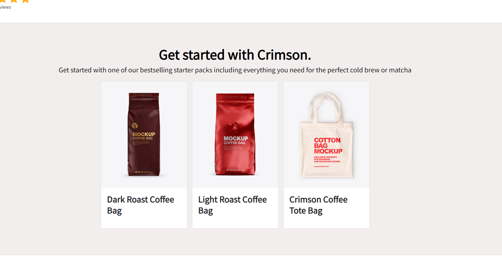
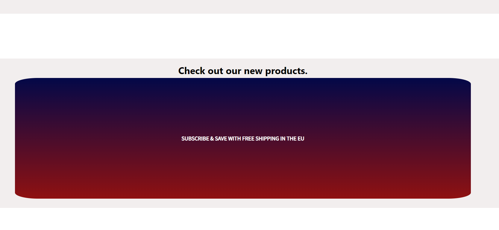
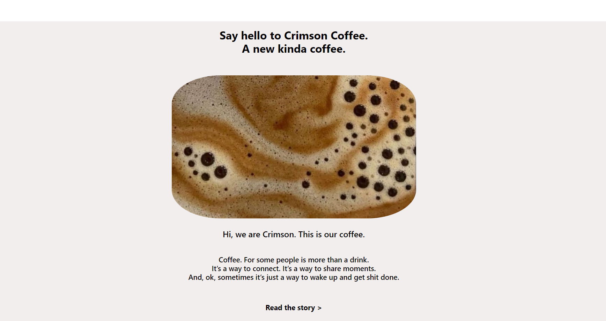
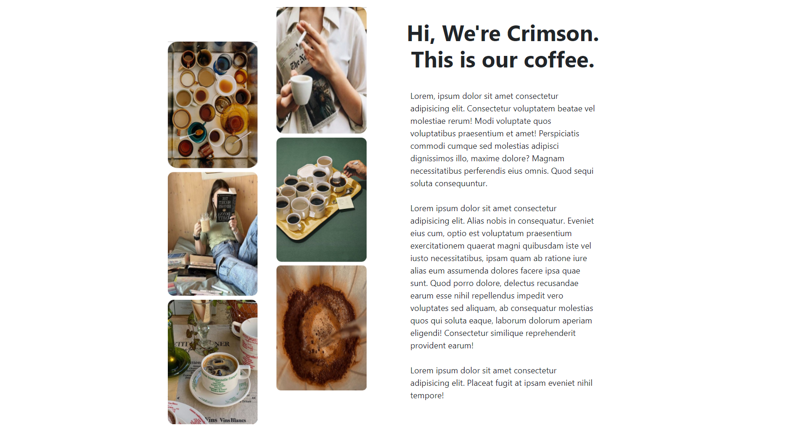
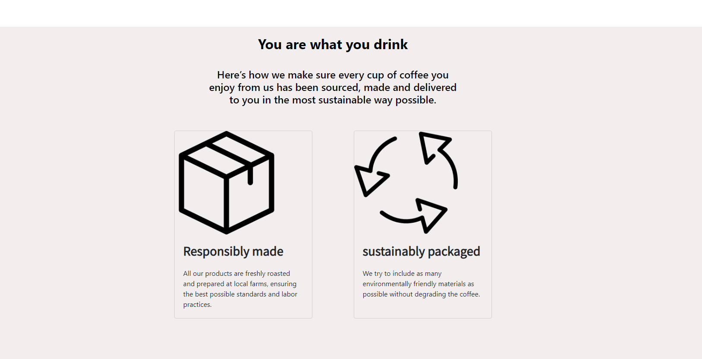
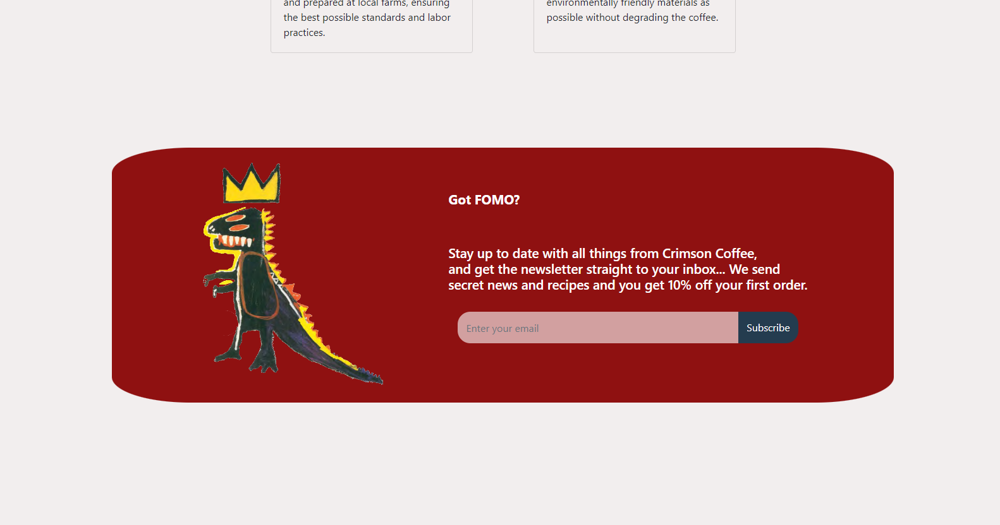
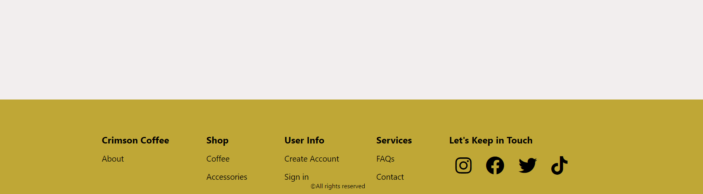
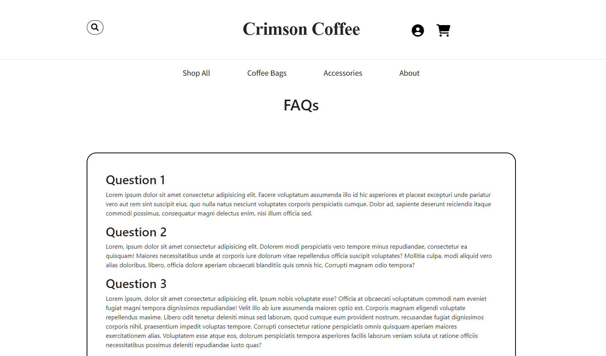

# CrimsonCoffee-eshop

Crimson Coffee e-shop is a school project developed for an e-commerce class. This web application allows users to browse and purchase coffee products online. It features a user-friendly shopping page for customers and an admin panel for managing products, prices, users, and orders. The project is built using PHP, JavaScript, HTML, CSS, and is connected to a MongoDB database using Composer for dependency management.

## Features

### User Features

- **Browse Products**: Users can browse a wide range of coffee products and view detailed information about each product.

- **Add to Cart**: Customers can add products to their shopping cart for later purchase.

- **Wishlist**: Users can add products to their wishlist for future reference.

- **Checkout**: Seamless checkout process for purchasing selected products.

### Admin Features

- **Product Management**: Admins can add new coffee products, update product information, and remove products from the store.

- **Price Management**: Admins can modify product prices to reflect changes in the market.

- **User Management**: Admins have the ability to add, edit, or remove user accounts.

- **Order Management**: View and manage customer orders, including order processing and status updates.

## Installation

Follow these steps to set up the Crimson Coffee e-shop project on your local machine:

1. Clone the repository:
   ```bash
   git clone https://github.com/your-username/Crimson-Coffee-e-shop.git

# Technologies and Pages Overview

This README provides an overview of the technologies used and the pages created for an online store.

## Technologies Used
The following technologies were used for the implementation of the online store:
- PHP
- HTML
- CSS
- Bootstrap
- JavaScript

## Pages Created

### End User Pages
1. Sign-Up Page
   - Files: `signUp.php`, `SignUpDB.php`

2. Sign-In Page
   - File: `signIn.php`

3. Home Page
   - File: `homepage.php`

4. Products Page
   - Files: `productsPage.php`, `accessoriesPage.php`, `CoffeeBagsPage.php`

5. User Profile
   - Files: `signIn.php`, `userProfile.php`

6. About Page
   - File: `about.php`

7. Search Results Page
   - File: `searchResults.php`

8. Cart Page
   - File: `cartPage.php`

9. Checkout Page
   - File: `checkoutPage.php`

10. Order Confirmation Page
    - File: `orderConfirmation.php`

11. Favorites/Wishlist Page
    - File: `wishlistPage.php`

12. Purchase History Page
    - File: `purchaseHistory.php`

13. Log Out
    - Files: `logout.php`, `logoutSession.php`

14. FAQs Page
    - File: `faqs.php`

### Administrator Pages
15. Admin Home Page
    - File: `adminHomepage.php`

16. User Management
    - Files: `adminUsersEdit.php`, `editUser.php`

17. User Login History
    - File: `userLoginHistory.php`

18. Product Management
    - File: `adminProducts.php`

19. Add Products
    - File: `adminProducts.php`

20. User Profile
    - File: `signIn.php`

Please note that this is an overview of the technologies and pages used in the online store's implementation.

# User Final Pages

## Home Page (Functionality 1)

The Home Page serves as the initial landing page for the store, offering information about the products and special offers.

- A company representation photo is featured, providing an overview of the company.
- Users are informed about free shipping (shipping) to all European Union countries for orders exceeding 60 euros.
- A 'Shop Now' button is prominently displayed, redirecting users to the product purchasing page.


Next, on the following page, you will find the "Crimson Favorites," which essentially showcases the favorite products of the company's employees. This was done because one of the company's goals is to establish personal and long-term relationships with its customers, making them feel closer.

Please note that if an admin user has not added any products to this page, this section will not be displayed.



Next, there is a section that informs users that they have the option to make purchases through social media!



Following that, the next section encourages users to learn more about the company, its history, and the goals it has set. The link directs users to the "About" page (about.php), which provides the above information. Users can also access the About page from the navigation bar by clicking on "About."




One of the company's primary objectives is sustainability. Therefore, the next section on the homepage addresses this. Specifically, it provides information about the sustainability of the products and packaging, certifying that the products have been manufactured with a minimal ecological footprint and without the exploitation of human existence in any way.



At the end of the homepage, there is a form for customers who wish to subscribe to the newsletter and receive notifications about news and special offers.



At the bottom of the page is the footer.



Here, you will find various links and the company's social media profiles in the footer. Additionally, the "FAQs" page is visible, containing various questions that a customer may have.



When a user is not registered or has not logged into their account, the navigation bar of the page is as follows. By clicking on the user icon, the user can log into their account or create a new account.

- User Registration and Login Page
  
