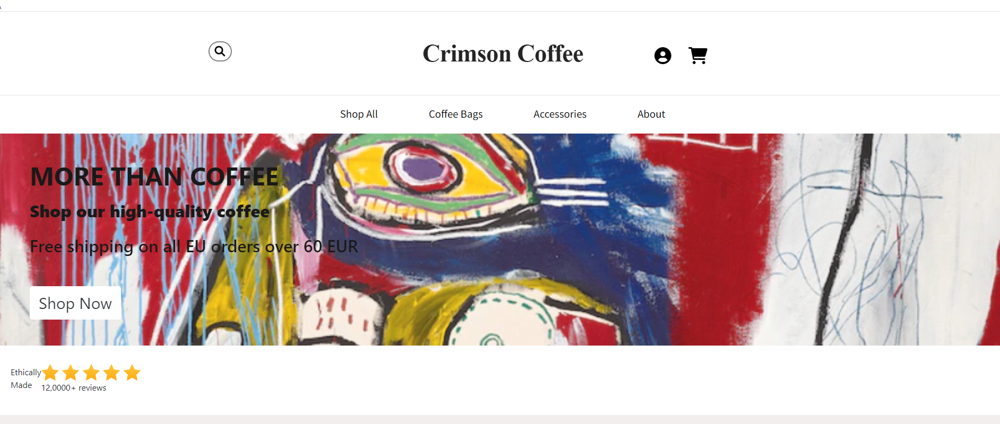

# CrimsonCoffee-eshop

Crimson Coffee e-shop is a school project developed for an e-commerce class. This web application allows users to browse and purchase coffee products online. It features a user-friendly shopping page for customers and an admin panel for managing products, prices, users, and orders. The project is built using PHP, JavaScript, HTML, CSS, and is connected to a MongoDB database using Composer for dependency management.

## Features

### User Features

- **Browse Products**: Users can browse a wide range of coffee products and view detailed information about each product.

- **Add to Cart**: Customers can add products to their shopping cart for later purchase.

- **Wishlist**: Users can add products to their wishlist for future reference.

- **Checkout**: Seamless checkout process for purchasing selected products.

### Admin Features

- **Product Management**: Admins can add new coffee products, update product information, and remove products from the store.

- **Price Management**: Admins can modify product prices to reflect changes in the market.

- **User Management**: Admins have the ability to add, edit, or remove user accounts.

- **Order Management**: View and manage customer orders, including order processing and status updates.

## Installation

Follow these steps to set up the Crimson Coffee e-shop project on your local machine:

1. Clone the repository:
   ```bash
   git clone https://github.com/your-username/Crimson-Coffee-e-shop.git

# Technologies and Pages Overview

This README provides an overview of the technologies used and the pages created for an online store.

## Technologies Used
The following technologies were used for the implementation of the online store:
- PHP
- HTML
- CSS
- Bootstrap
- JavaScript

## Pages Created

### End User Pages
1. Sign-Up Page
   - Files: `signUp.php`, `SignUpDB.php`

2. Sign-In Page
   - File: `signIn.php`

3. Home Page
   - File: `homepage.php`

4. Products Page
   - Files: `productsPage.php`, `accessoriesPage.php`, `CoffeeBagsPage.php`

5. User Profile
   - Files: `signIn.php`, `userProfile.php`

6. About Page
   - File: `about.php`

7. Search Results Page
   - File: `searchResults.php`

8. Cart Page
   - File: `cartPage.php`

9. Checkout Page
   - File: `checkoutPage.php`

10. Order Confirmation Page
    - File: `orderConfirmation.php`

11. Favorites/Wishlist Page
    - File: `wishlistPage.php`

12. Purchase History Page
    - File: `purchaseHistory.php`

13. Log Out
    - Files: `logout.php`, `logoutSession.php`

14. FAQs Page
    - File: `faqs.php`

### Administrator Pages
15. Admin Home Page
    - File: `adminHomepage.php`

16. User Management
    - Files: `adminUsersEdit.php`, `editUser.php`

17. User Login History
    - File: `userLoginHistory.php`

18. Product Management
    - File: `adminProducts.php`

19. Add Products
    - File: `adminProducts.php`

20. User Profile
    - File: `signIn.php`

Please note that this is an overview of the technologies and pages used in the online store's implementation.

# User Final Pages

## Home Page (Functionality 1)

The Home Page serves as the initial landing page for the store, offering information about the products and special offers.

- A company representation photo is featured, providing an overview of the company.
- Users are informed about free shipping (shipping) to all European Union countries for orders exceeding 60 euros.
- A 'Shop Now' button is prominently displayed, redirecting users to the product purchasing page.



